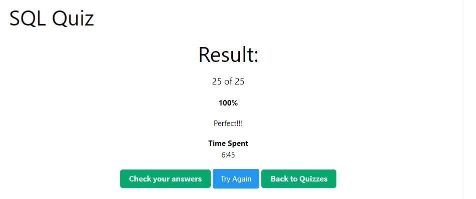

# Part 2

**For the following points, the MySQL database used is deployed using docker-compose and wsl2 for windows and the data was created using [mockaroo](https://www.mockaroo.com/) .**

### 1. Explain the difference, in databases, between ‘Having’ and ‘where’ when it comes to a query. Develop one example for each one of this two cases and point out the difference.

In SQL, the __`WHERE`__ clause is used to filter records individually (row by row), and before any groupings are made (Like a __`GROUP BY`__ statement). That means that the __`WHERE`__ clause can not be used to filter records that belong to a group of records, because the __`WHERE`__ clause can not reference aggregate columns (columns that are the result of an aggregate function, like __`SUM`__, __`COUNT`__, __`AVG`__, __`MIN`__, __`MAX`__, etc.).

The __`HAVING`__ clause is used to filter records that belong to a group of records, is often used with the __`GROUP BY`__ clause.

We can use the __`WHERE`__ clause and the __`HAVING`__ clause in the same query, but the __`WHERE`__ clause is applied first, then the __`GROUP BY`__ clause, and finally the __`HAVING`__ clause.

Also if we use the same condition in the __`WHERE`__ clause and the __`HAVING`__ clause, the __`WHERE`__ clause will be faster (If the engine follows the SQL standard).

We can obtain the same results using the __`WHERE`__ clause and the __`HAVING`__ clause.

__`WHERE`__ clause example:

```sql

SELECT *
FROM Student
WHERE GPA >= 3.50;
```

__`HAVING`__ clause example:

```sql
SELECT *
FROM Student
HAVING GPA >= 3.50;
```

Both queries will return the same results. But the __`WHERE`__ clause is faster (In theory, only if the SQL engine follows the SQL standard).

If we want to filter records that belong to a group of records, we must use the __`HAVING`__ clause. Because the __`WHERE`__ clause can not reference aggregate columns.

__`WHERE`__ clause example:

```sql
SELECT Class, AVG(GPA) as AvgGPA
FROM Student
GROUP BY Class
HAVING AVG(GPA) >= 3.50;
```

In the above example, the __`WHERE`__ clause can not be used, because the __`WHERE`__ clause can not reference aggregate columns, in this case __AVG(GPA)__ produces an aggregate column called __AvgGPA__.

### 2. Write a query to create a data table ‘Student’ with the following attributes in it: ‘Name', ‘Code', ‘Class’, ‘Age’, ‘Favorite Subject', ‘GPA’ (5.0 scale).

```sql
CREATE TABLE IF NOT EXISTS Student (
	Name varchar(100) not null,
	Code int auto_increment not null primary key,
	Class varchar(100) not null,
	Age int not null,
	Favorite_Subject varchar(100) not null,
	GPA decimal(3,2) check (GPA >= 0.0 and GPA <= 5.00) not null
);
```

### 3. Insert at least 40 records in the last table with close to real data.

```sql
insert into Student (Name, Class, Age, Favorite_Subject, GPA) values ('Rebekah Antonopoulos', 'RU', 62, 'CTAs', 3.01);
insert into Student (Name, Class, Age, Favorite_Subject, GPA) values ('Dido Birkett', 'JP', 26, 'JProbe', 1.93);
insert into Student (Name, Class, Age, Favorite_Subject, GPA) values ('Merill Pikhno', 'BR', 49, 'GPU', 2.68);
insert into Student (Name, Class, Age, Favorite_Subject, GPA) values ('Wilhelmine Fansy', 'AL', 18, 'Facilitation', 1.43);
insert into Student (Name, Class, Age, Favorite_Subject, GPA) values ('Nikolai Ninnis', 'PH', 28, 'OEE', 4.09);
insert into Student (Name, Class, Age, Favorite_Subject, GPA) values ('Linc Georgi', 'CA', 12, 'Ticketing', 4.13);
insert into Student (Name, Class, Age, Favorite_Subject, GPA) values ('Ibbie Callard', 'ID', 54, 'Competitive Analysis', 0.79);
insert into Student (Name, Class, Age, Favorite_Subject, GPA) values ('Lief Robertson', 'PT', 51, 'Medical Devices', 1.79);
insert into Student (Name, Class, Age, Favorite_Subject, GPA) values ('Ernestine Humbey', 'PT', 5, 'BPO', 0.25);
insert into Student (Name, Class, Age, Favorite_Subject, GPA) values ('Codie Comben', 'CN', 67, 'Whole House Renovations', 0.2);
insert into Student (Name, Class, Age, Favorite_Subject, GPA) values ('Wilbur Quinnette', 'HN', 24, 'PFMEA', 0.52);
insert into Student (Name, Class, Age, Favorite_Subject, GPA) values ('Leoline Goodswen', 'JP', 97, 'TSW', 2.68);
insert into Student (Name, Class, Age, Favorite_Subject, GPA) values ('Tallulah Brosio', 'CN', 68, 'eGaming', 3.93);
insert into Student (Name, Class, Age, Favorite_Subject, GPA) values ('Bronnie Adamsson', 'CA', 97, 'TTL', 0.58);
insert into Student (Name, Class, Age, Favorite_Subject, GPA) values ('Bertrand Lafayette', 'ID', 98, 'Leases', 4.29);
insert into Student (Name, Class, Age, Favorite_Subject, GPA) values ('Linnell Sreenan', 'KG', 44, 'Analytical Skills', 0.59);
insert into Student (Name, Class, Age, Favorite_Subject, GPA) values ('Persis Hynam', 'PL', 17, 'Banking', 3.81);
insert into Student (Name, Class, Age, Favorite_Subject, GPA) values ('Jameson Walewski', 'VN', 78, 'Cisco VPN', 3.77);
insert into Student (Name, Class, Age, Favorite_Subject, GPA) values ('Madonna McClory', 'TJ', 8, 'Aeronautics', 4.56);
insert into Student (Name, Class, Age, Favorite_Subject, GPA) values ('Kelvin Radband', 'UA', 24, 'TVPaint', 1.77);
insert into Student (Name, Class, Age, Favorite_Subject, GPA) values ('Marisa Cathie', 'BR', 63, 'Vector NTI', 0.6);
insert into Student (Name, Class, Age, Favorite_Subject, GPA) values ('Stirling Darell', 'CN', 37, 'After Effects', 2.99);
insert into Student (Name, Class, Age, Favorite_Subject, GPA) values ('Al Cottie', 'PF', 53, 'Electrical Troubleshooting', 2.62);
insert into Student (Name, Class, Age, Favorite_Subject, GPA) values ('Janel Flatt', 'CN', 2, 'Biomedical Engineering', 2.88);
insert into Student (Name, Class, Age, Favorite_Subject, GPA) values ('Abram Upfold', 'CN', 67, 'RMP', 0.16);
insert into Student (Name, Class, Age, Favorite_Subject, GPA) values ('York Bezley', 'BR', 10, 'JMeter', 0.44);
insert into Student (Name, Class, Age, Favorite_Subject, GPA) values ('Erika Bett', 'TW', 50, 'QoS', 0.2);
insert into Student (Name, Class, Age, Favorite_Subject, GPA) values ('Saw Denson', 'PE', 61, 'WMOS', 3.9);
insert into Student (Name, Class, Age, Favorite_Subject, GPA) values ('Billie Ellacombe', 'RU', 75, 'Flow Cytometry', 0.98);
insert into Student (Name, Class, Age, Favorite_Subject, GPA) values ('Garrard Eborn', 'CN', 63, 'MySQL Cluster', 0.04);
insert into Student (Name, Class, Age, Favorite_Subject, GPA) values ('Kristina Larman', 'CN', 36, 'SLA', 3.41);
insert into Student (Name, Class, Age, Favorite_Subject, GPA) values ('Alica Cometti', 'CN', 71, 'Silverlight', 2.43);
insert into Student (Name, Class, Age, Favorite_Subject, GPA) values ('Filmore Glynne', 'RU', 69, 'RF Planning', 1.0);
insert into Student (Name, Class, Age, Favorite_Subject, GPA) values ('Edith O''Meara', 'FR', 60, 'Eyewear', 4.12);
insert into Student (Name, Class, Age, Favorite_Subject, GPA) values ('Hermon Bogart', 'PY', 58, 'Sports Marketing', 1.15);
insert into Student (Name, Class, Age, Favorite_Subject, GPA) values ('Costa Gresly', 'US', 63, 'BBP', 1.53);
insert into Student (Name, Class, Age, Favorite_Subject, GPA) values ('Clayton Mowling', 'ID', 10, 'NCover', 4.92);
insert into Student (Name, Class, Age, Favorite_Subject, GPA) values ('Emlynne Halsall', 'TH', 91, 'DXX', 2.61);
insert into Student (Name, Class, Age, Favorite_Subject, GPA) values ('Aldo Neesam', 'AM', 36, 'IIA Standards', 1.83);
insert into Student (Name, Class, Age, Favorite_Subject, GPA) values ('Gipsy Lydall', 'PH', 96, 'QEMU', 1.46);

SELECT COUNT(1) from Student; 
```


### 4. Write a query to get the average of the GPA from all the students whose name starts with ‘A’.

```sql
SELECT TRUNCATE(AVG(GPA),2) as "average_GPA" from Student where name LIKE "A%";
```

### 5. Write a query to get the list of students that are in the same class, have a GPA higher than 3.5/5.0 and order them by Age and Name.

```sql
SELECT name, class, GPA, age
FROM Student
WHERE class IN (
    SELECT class
    FROM Student
    GROUP BY class
    HAVING COUNT(DISTINCT name) > 1
)
AND GPA > 3.5
ORDER BY age, name asc;
```

### 6. Write a query to get the list of all the students with ‘Name', ‘Code', ‘Class’, ‘Age’, ‘Favorite Subject', ‘GPA’.

```sql
SELECT * FROM  Student WHERE  Name IS NOT NULL AND
Code IS NOT NULL AND 
Class IS NOT NULL AND 
Age IS NOT NULL AND
Favorite_Subject IS NOT NULL AND 
GPA IS NOT NULL;
```

### 7. Take the following 25 question quiz about SQL, please include a screenshot about the results and time it took to take the test.
http://www.w3schools.com/quiztest/quiztest.asp?qtest=SQL



