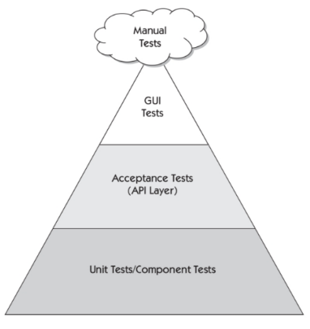

# Part 3

### 1. What is the difference between a unit test, an acceptance test, an integration test and an end-to-end test?

The scope of all these tests is different. Unit tests are the smallest tests, they test a single function or method (A single piece of code), generally in isolation and written by the developer.

Acceptance tests are the largest tests, they test the whole application and are written by the customer, the product owner or the QA team, becaoause they are the ones who know the requirements of the application., are focused on the business requirements and are written in a language that the customer understands.

Integration tests are in between, they test the integration between different parts of the application, two different components or modules, or even the integration between the application and an external service. They are written by the developer and are focused on the design and architecture of the application. 

End-to-end tests, test the application from the user's perspective and they focuses on the steps that the user will take to accomplish a task. They are written by the QA team and are focused on the user experience in a real environment.

### 2. Could you explain Cohn's automation pyramid?

If we scale the pyramid, we should automate less at the top and more at the bottom. 

The reason is that the tests at the bottom are faster, cheaper and more reliable than the tests at the top. So, we should have more unit tests than acceptance tests, and more acceptance tests than GUI tests.

The acceptance tests are slower and more expensive than the unit tests, but they are more reliable than the GUI tests. The GUI tests are the slowest and the most expensive tests, because they are the most fragile tests and they are more difficult to maintain, but they are the only ones that "automaton" the user experience.

### 3. Could you explain the difference between a black box testing and a white box testing?

We can think of the application as a black box, we can not see the internal structure of the application, we can only see the inputs and the outputs of the application. The test that we develop and execute without knowing the internal structure of the application is called a black box test.

The developer knows the internal structure of the application, so he can develop and execute tests that take into account the internal structure of the application, these tests are called white box tests.

### 4. What is the purpose of an exploratory test and when is it useful to run them?

The exploratory tests are tests that are executed without a plan, they are executed by the QA team, and that test are manual tests.

The purpose of the exploratory tests is to find bugs that the other tests did not find, and usually they are executed when the application is almost finished.

Is a type of ad-hoc testing, and the QA team can use the knowledge that they have about the application to find bugs.

### 5. Mention at least 5 test design techniques and explain them briefly

**Equivalence Class Partitioning:** This technique divides the input space into groups with similar expected behavior.

**Boundary Value Analysis:** This technique focuses on testing the edges of input domains, like minimum and maximum values.

**Decision Table Testing:** This technique uses a tabular format to systematically identify all possible combinations of input conditions and their expected outcomes.

**State Transition Testing:** This technique focuses on how a system transitions between different states based on inputs and events. 

**Error Guessing:** This technique relies on the tester's experience and knowledge of the system to identify potential failure points.

### 6. What is the purpose of the following types of tests?

**a. Functional test:** These tests are used to verify that the application works as expected, focuses on the business requirements.

**b. Performance test:** These tests are used to verify that the application works as expected under a specific workload, like the number of users, the number of requests per second, etc.

**c. Security test:** These tests are used to verify that the application is secure, and that the application is not vulnerable to attacks.

**d. Usability test:** These tests are used to verify that the application is easy to use, and that the user can accomplish a task without problems, and that the user experience is good, is a subjective test, and usually is not supervised because we search for the user's opinion.

**e. API test:** These tests are used to verify that the API works as expected, and that the API is not changing the response format, or the response status code, etc.

**f. Unit Test:** These tests are used to verify that a single part of the code works as expected, and that the code is not breaking the application.